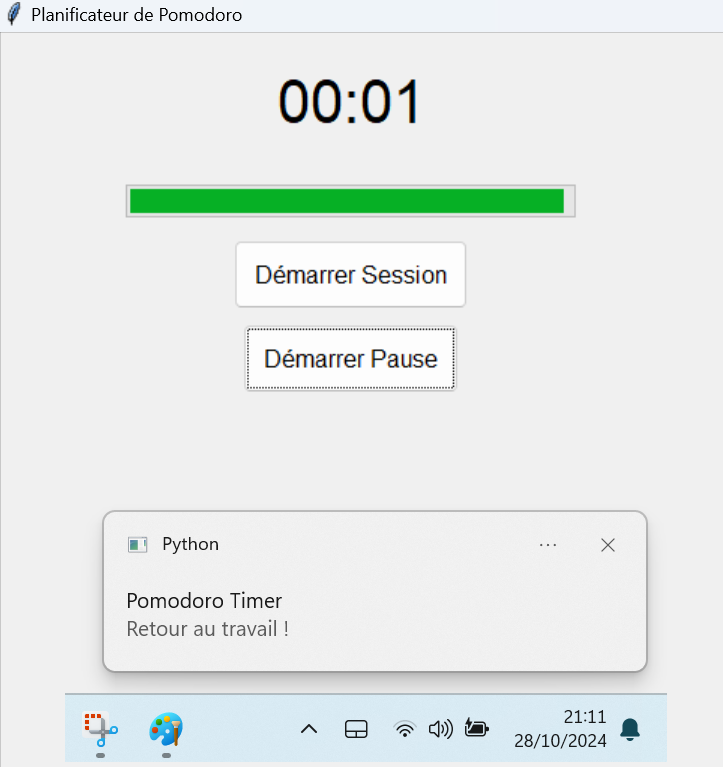

# 🍅 WorkCycle - Planificateur de Pomodoro 🍅


**WorkCycle** est une application de planification de temps basée sur la technique Pomodoro ! Conçue pour améliorer la productivité et maintenir la concentration, elle vous aide à gérer votre travail par sessions de 25 minutes, suivies de courtes pauses bien méritées ! 🕒

---

## 🚀 Fonctionnalités Principales

- **Sessions de Travail de 25 Minutes** : Gardez votre focus avec des sessions de 25 minutes.
- **Pause de 5 Minutes** : Reposez-vous et revenez en pleine forme !
- **Notifications Automatiques** : Recevez des rappels pour chaque début et fin de session.  
- **Interface Simple et Colorée** : Interface graphique conviviale construite avec Tkinter.

---

## 🎉 Aperçu de l'Interface




---

## 🛠️ Installation et Utilisation

### Prérequis
- **Python 3.8+** : Assurez-vous d'avoir Python installé. [Téléchargez Python ici](https://www.python.org/downloads/)

### Installation des Dépendances
1. Clonez le repository :
   ```bash
   git clone https://github.com/votre_nom_d_utilisateur/WorkCycle.git
   cd WorkCycle
